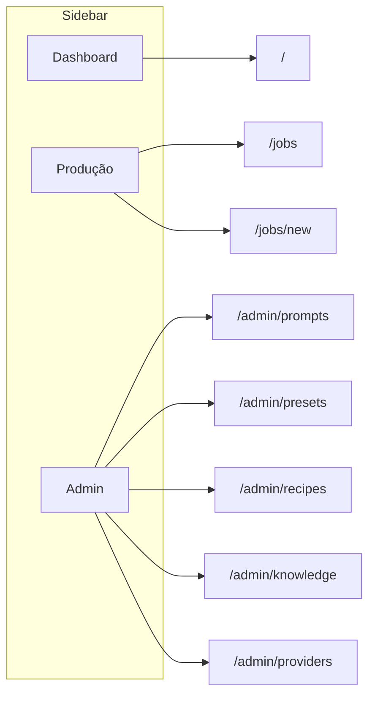

# Arquitetura de Informação — Video Factory OS

> **Versão:** 0.1  
> **Data:** 2025-12-13  
> **Status:** Aprovado (Gate 0.5)

---

## Visão Geral

O Video Factory OS é organizado em **módulos funcionais** que refletem o fluxo de trabalho do usuário: criar produção → acompanhar → administrar configs.

```
┌─────────────────────────────────────────────────────────────────────┐
│                         VIDEO FACTORY OS                            │
├─────────────────────────────────────────────────────────────────────┤
│                                                                      │
│  ┌──────────────┐  ┌───────────────────────────────────────────┐    │
│  │   SIDEBAR    │  │              ÁREA PRINCIPAL               │    │
│  ├──────────────┤  ├───────────────────────────────────────────┤    │
│  │              │  │                                           │    │
│  │ • Dashboard  │  │  [Conteúdo do módulo selecionado]         │    │
│  │ • Produção   │  │                                           │    │
│  │ • Admin ▼    │  │                                           │    │
│  │   - Prompts  │  │                                           │    │
│  │   - Presets  │  │                                           │    │
│  │   - Recipes  │  │                                           │    │
│  │   - KB       │  │                                           │    │
│  │   - Providers│  │                                           │    │
│  │              │  │                                           │    │
│  └──────────────┘  └───────────────────────────────────────────┘    │
│                                                                      │
└─────────────────────────────────────────────────────────────────────┘
```

---

## Módulos

### 1. Dashboard

| Aspecto | Descrição |
|---------|-----------|
| **Objetivo** | Visão geral da fábrica: jobs ativos, métricas, alertas |
| **Objetos** | Job (lista), Metrics (agregadas) |
| **Ações** | Ver jobs, filtrar por status, acessar job detail |
| **Estado crítico** | Jobs `failed` ou `running` há muito tempo |
| **Erros** | Nenhum job? Mostrar empty state + CTA |

**Rotas:**
- `/` → Dashboard principal

---

### 2. Produção (Jobs)

| Aspecto | Descrição |
|---------|-----------|
| **Objetivo** | Criar e gerenciar produções de vídeo |
| **Objetos** | Job, Recipe, Step, Artifact |
| **Ações** | Nova produção, ver lista, acessar detail, retry, cancel |
| **Estado crítico** | Step `failed` com retry disponível |
| **Erros** | Recipe não encontrada, input inválido |

**Rotas:**
- `/jobs` → Lista de jobs
- `/jobs/new` → Criar novo job
- `/jobs/[id]` → Job Detail (com steps, logs, artifacts)

---

### 3. Job Detail

| Aspecto | Descrição |
|---------|-----------|
| **Objetivo** | Acompanhar execução de um job específico |
| **Objetos** | Job, JobStep[], Artifact[], Manifest |
| **Ações** | Ver pipeline, ver logs, retry step, ver/baixar artifacts |
| **Estado crítico** | Step em `failed`, mostrar error + retry button |
| **Erros** | Job não existe (404), step sem logs |

**Rotas:**
- `/jobs/[id]` → Overview + pipeline
- `/jobs/[id]/logs` → Logs completos
- `/jobs/[id]/manifest` → Manifest JSON

---

### 4. Admin — Prompts

| Aspecto | Descrição |
|---------|-----------|
| **Objetivo** | Gerenciar prompts de IA (sem deploy) |
| **Objetos** | Prompt (com versões) |
| **Ações** | Listar, ver, editar, duplicar, ativar/desativar |
| **Estado crítico** | Prompt ativo sem versão válida |
| **Erros** | Slug duplicado, template inválido |

**Rotas:**
- `/admin/prompts` → Lista
- `/admin/prompts/[slug]` → Editar

---

### 5. Admin — Presets

| Aspecto | Descrição |
|---------|-----------|
| **Objetivo** | Gerenciar presets (voice, video, ssml, effects) |
| **Objetos** | Preset (unificado com `type`) |
| **Ações** | Listar (por type), criar, editar, duplicar |
| **Estado crítico** | Preset referenciado por recipe não existe |
| **Erros** | Config JSON inválido para o type |

**Rotas:**
- `/admin/presets` → Lista com tabs por type
- `/admin/presets/[id]` → Editar

---

### 6. Admin — Recipes

| Aspecto | Descrição |
|---------|-----------|
| **Objetivo** | Gerenciar receitas (config do pipeline) |
| **Objetos** | Recipe (com referências a prompts/presets) |
| **Ações** | Listar, criar, editar, clonar, ativar/desativar |
| **Estado crítico** | Recipe com refs quebradas |
| **Erros** | Pipeline step inválido |

**Rotas:**
- `/admin/recipes` → Lista
- `/admin/recipes/[slug]` → Editar

---

### 7. Admin — Knowledge Base

| Aspecto | Descrição |
|---------|-----------|
| **Objetivo** | Gerenciar docs de contexto por tier |
| **Objetos** | KnowledgeBase (tier1, tier2, tier3) |
| **Ações** | Listar (por tier/categoria), criar, editar |
| **Estado crítico** | KB referenciada não existe |
| **Erros** | Tier inválido, categoria duplicada |

**Rotas:**
- `/admin/knowledge` → Lista com filtros
- `/admin/knowledge/[id]` → Editar

---

### 8. Admin — Providers

| Aspecto | Descrição |
|---------|-----------|
| **Objetivo** | Configurar providers externos (LLM, TTS, Storage) |
| **Objetos** | Provider (com credentials criptografadas) |
| **Ações** | Listar, configurar, testar conexão |
| **Estado crítico** | Provider ativo sem credenciais |
| **Erros** | Teste de conexão falhou |

**Rotas:**
- `/admin/providers` → Lista
- `/admin/providers/[id]` → Configurar

---

## Mapa de Rotas (App Router)

```
app/
├── (dashboard)/
│   └── page.tsx                    # Dashboard
├── (production)/
│   └── jobs/
│       ├── page.tsx                # Lista Jobs
│       ├── new/
│       │   └── page.tsx            # Nova Produção
│       └── [id]/
│           ├── page.tsx            # Job Detail
│           ├── logs/
│           │   └── page.tsx        # Logs
│           └── manifest/
│               └── page.tsx        # Manifest
├── admin/
│   ├── prompts/
│   │   ├── page.tsx                # Lista Prompts
│   │   └── [slug]/
│   │       └── page.tsx            # Editar Prompt
│   ├── presets/
│   │   ├── page.tsx                # Lista Presets
│   │   └── [id]/
│   │       └── page.tsx            # Editar Preset
│   ├── recipes/
│   │   ├── page.tsx                # Lista Recipes
│   │   └── [slug]/
│   │       └── page.tsx            # Editar Recipe
│   ├── knowledge/
│   │   ├── page.tsx                # Lista KB
│   │   └── [id]/
│   │       └── page.tsx            # Editar KB
│   └── providers/
│       ├── page.tsx                # Lista Providers
│       └── [id]/
│           └── page.tsx            # Configurar
├── api/
│   ├── health/
│   │   └── route.ts                # Health check
│   ├── jobs/
│   │   └── route.ts                # CRUD Jobs
│   └── ...
└── layout.tsx                      # Layout com Sidebar
```

---

## Navegação Principal



---

## Evidências

### Estrutura de rotas criada
```bash
# Comando para verificar estrutura
find app -name "*.tsx" -o -name "*.ts" | head -20
```

### Rotas existentes (atual)
```
app/
├── page.tsx           # Dashboard (existe)
├── jobs/
│   ├── new/page.tsx   # Nova Produção (existe)
│   └── [id]/page.tsx  # Job Detail (existe)
└── api/
    └── health/route.ts # Health (existe)
```

### Rotas a criar
- `admin/*` (todas)
- `(dashboard)` e `(production)` groups
- Layout com Sidebar

---

**Próximo:** `01-domain-model.md`
