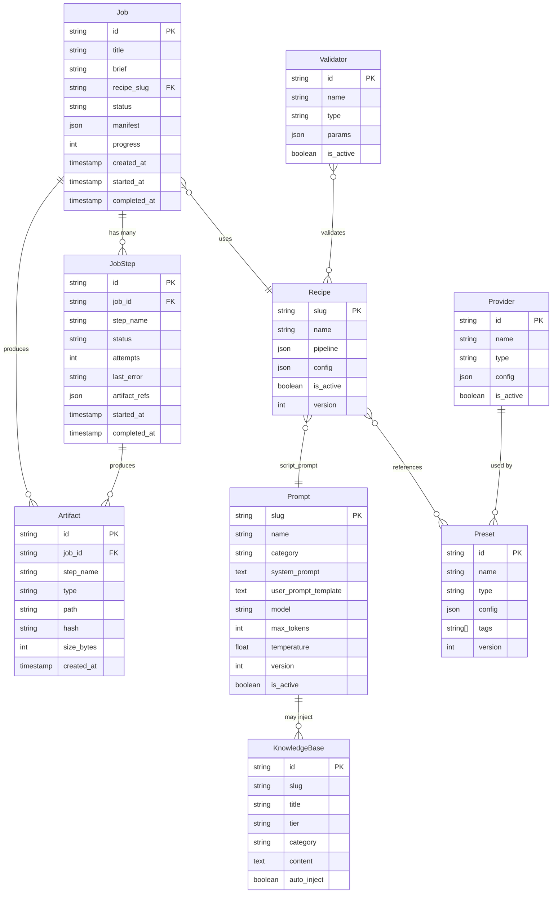

# Domain Model — Video Factory OS

> **Versão:** 0.1  
> **Data:** 2025-12-13  
> **Status:** Aprovado (Gate 0.5)

---

## Visão Geral

O modelo de domínio define as **entidades centrais** do sistema e seus relacionamentos. O Video Factory é **Job-centric**: um Job representa uma produção de vídeo completa.

---

## Diagrama de Entidades



---

## Definições Formais

### Job
> **Um Job = uma produção de vídeo.**

- Representa o processo completo de gerar um vídeo a partir de inputs (título, brief)
- Referencia uma Recipe que define o pipeline
- Contém o Manifest final (snapshot de tudo que foi usado)
- Status: `pending` → `running` → `completed` | `failed`

### JobStep
> **Um Step = uma etapa idempotente do pipeline.**

- Unidade atômica de execução
- Pode falhar e ser retentada
- Produz Artifacts específicos
- Steps: `script`, `ssml`, `tts`, `render`, `thumb`

### Artifact
> **Um Artifact = output versionado de um Step.**

- Arquivo gerado (script.md, audio.mp3, video.mp4)
- Hash para verificar integridade
- Path relativo ao job

### Recipe
> **Uma Recipe = configuração reusável do pipeline.**

- Define quais steps executar e em que ordem
- Referencia prompts e presets específicos
- Permite criar vídeos sem re-configurar tudo

### Prompt
> **Um Prompt = template de IA editável sem deploy.**

- Governança: `getPromptOrThrow()` — falha se não existir
- Versionado (histórico de mudanças)
- Suporta variáveis `{{var}}` e condicionais `{{#if}}`

### KnowledgeBase
> **KB = documentos de contexto por tier.**

| Tier | Descrição | Quando Carrega |
|------|-----------|----------------|
| tier1 | DNA/regras fundamentais | Sempre |
| tier2 | Contexto por tipo de vídeo | Por categoria |
| tier3 | Exemplos/referências | Sob demanda |

### Preset
> **Preset = configuração tipada (voice, video, ssml, effects).**

- Unificado em uma tabela com `type`
- Config JSON validado por Zod discriminated union
- Referenciado por Recipes

Tipos:
- `voice`: voz Azure (name, rate, pitch, style)
- `video`: resolução, fps, encoder, codec
- `ssml`: templates de marcação
- `effects`: filtros FFmpeg

### Provider
> **Provider = serviço externo configurável.**

- Tipos: `llm`, `tts`, `storage`, `render`
- Credenciais (criptografadas em produção)
- Testável (verificar conexão)

### Validator
> **Validator = regra de validação reutilizável.**

- Referenciado por Recipes
- Executa antes/depois de steps
- Starter pack (5):
  - `required_fields`
  - `max_chars`
  - `file_exists`
  - `duration_range`
  - `resolution_fps_range`

---

## Relacionamentos-Chave

```
Job ←→ Recipe (N:1)
  Job usa uma Recipe para saber o que executar

Job ←→ JobStep (1:N)
  Job tem múltiplos Steps (um por etapa do pipeline)

JobStep ←→ Artifact (1:N)
  Cada Step pode produzir múltiplos Artifacts

Recipe ←→ Prompt (N:1)
  Recipe referencia qual prompt usar para roteiro

Recipe ←→ Preset (N:M)
  Recipe pode usar múltiplos presets (voz, vídeo, etc)

Recipe ←→ Validator (N:M)
  Recipe pode ter múltiplos validators

Prompt ←→ KnowledgeBase (1:N)
  Prompt pode injetar KB por categoria/tier
```

---

## Fluxo de Dados

```
Input (título, brief)
        ↓
    Job criado
        ↓
    Recipe carregada
        ↓
    Manifest inicial gerado
        ↓
    Steps executados sequencialmente
        ↓
    Artifacts salvos por step
        ↓
    Manifest final atualizado
        ↓
    Job = completed
```

---

## Evidências

### Schema DB existe
```bash
# Verificar schema
cat lib/db/schema.ts | grep -E "export const (jobs|prompts|recipes|presets)" | head -10
```

### Output esperado
```typescript
export const prompts = sqliteTable('prompts', { ... })
export const knowledgeBase = sqliteTable('knowledge_base', { ... })
export const recipes = sqliteTable('recipes', { ... })
export const presets = sqliteTable('presets', { ... })
export const jobs = sqliteTable('jobs', { ... })
export const jobSteps = sqliteTable('job_steps', { ... })
export const artifacts = sqliteTable('artifacts', { ... })
```

### Seed data existe
```bash
npm run db:seed  # Deve popular dados iniciais
```

---

**Próximo:** `02-manifest-contract.md`
