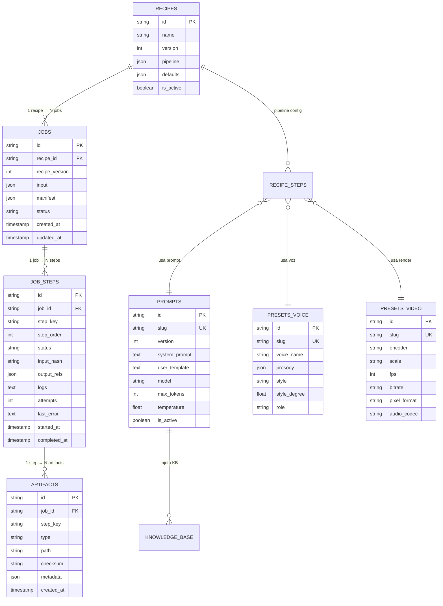

# 🏗️ Video Factory OS - Arquitetura Técnica

## Visão Geral

```
┌─────────────────────────────────────────────────────────────────────┐
│                         VIDEO FACTORY OS                             │
├─────────────────────────────────────────────────────────────────────┤
│                                                                      │
│  ┌──────────────┐    ┌──────────────┐    ┌──────────────┐          │
│  │     UI       │    │  Admin UI    │    │   API        │          │
│  │  (Jobs)      │    │  (Config)    │    │  Routes      │          │
│  └──────┬───────┘    └──────┬───────┘    └──────┬───────┘          │
│         │                   │                   │                   │
│         └───────────────────┼───────────────────┘                   │
│                             ▼                                        │
│  ┌──────────────────────────────────────────────────────────────┐   │
│  │                      JOB ENGINE                               │   │
│  │  • Orquestra steps • Checkpoints • Idempotência • Logs       │   │
│  └──────────────────────────────────────────────────────────────┘   │
│                             │                                        │
│         ┌───────────────────┼───────────────────┐                   │
│         ▼                   ▼                   ▼                   │
│  ┌────────────┐     ┌────────────┐      ┌────────────┐             │
│  │  Adapters  │     │  Prompts   │      │  Presets   │             │
│  │ Claude/TTS │     │  Registry  │      │  Registry  │             │
│  │  FFmpeg    │     │            │      │            │             │
│  └────────────┘     └────────────┘      └────────────┘             │
│         │                   │                   │                   │
│         └───────────────────┼───────────────────┘                   │
│                             ▼                                        │
│  ┌──────────────────────────────────────────────────────────────┐   │
│  │                    SQLite + Drizzle ORM                       │   │
│  └──────────────────────────────────────────────────────────────┘   │
│                                                                      │
└─────────────────────────────────────────────────────────────────────┘
```

## Stack Tecnológica

| Camada | Tecnologia | Justificativa |
|--------|------------|---------------|
| **Framework** | Next.js 14 (App Router) | Full-stack, Server Components, API Routes |
| **UI** | React + Tailwind + shadcn/ui | Componentes prontos, design moderno |
| **DB** | SQLite + Drizzle ORM | Local-first, migrations, tipagem |
| **LLM** | Claude (Anthropic SDK) | Qualidade para roteiros longos |
| **TTS** | Azure Speech | Qualidade ES-MX, estilos, SSML |
| **Render** | FFmpeg + VideoToolbox | Aceleração hardware no Mac |

## Modelo de Dados



## Job Engine - Fluxo de Execução

```
┌─────────────┐
│ Criar Job   │
└──────┬──────┘
       ▼
┌─────────────────────────────────────────────────────────────┐
│ Para cada step no pipeline da recipe:                        │
│                                                              │
│   ┌───────────────────┐                                     │
│   │ Calcular input_hash│ (inputs + config snapshot)         │
│   └─────────┬─────────┘                                     │
│             ▼                                                │
│   ┌───────────────────┐    ┌─────────────────────────────┐  │
│   │ Step já existe    │─Sim─▶│ input_hash igual? → SKIP   │  │
│   │ com status=ok?    │    │ input_hash diferente? → RUN │  │
│   └─────────┬─────────┘    └─────────────────────────────┘  │
│             │ Não                                            │
│             ▼                                                │
│   ┌───────────────────┐                                     │
│   │ Executar step     │                                     │
│   │ via adapter       │                                     │
│   └─────────┬─────────┘                                     │
│             ▼                                                │
│   ┌───────────────────┐                                     │
│   │ Salvar:           │                                     │
│   │ • output_refs     │                                     │
│   │ • artifacts       │                                     │
│   │ • logs            │                                     │
│   │ • status=success  │                                     │
│   └─────────┬─────────┘                                     │
│             ▼                                                │
│   ┌───────────────────┐                                     │
│   │ Atualizar manifest│                                     │
│   └───────────────────┘                                     │
│                                                              │
└─────────────────────────────────────────────────────────────┘
       ▼
┌─────────────┐
│ Job Done    │
└─────────────┘
```

## Adapters

Cada adapter implementa uma interface comum:

```typescript
interface Adapter<TInput, TOutput> {
  name: string;
  execute(input: TInput, config: Config): Promise<TOutput>;
}
```

| Adapter | Input | Output | Config vem do DB |
|---------|-------|--------|------------------|
| **ClaudeAdapter** | prompt + vars | texto | prompts.model, max_tokens, temp |
| **AzureTTSAdapter** | SSML | mp3 path | presets_voice.* |
| **FFmpegAdapter** | audio + assets | mp4 path | presets_video.*, presets_effects.* |
| **SSMLParserAdapter** | Stage Directions | SSML | presets_voice.* (voz/pause map) |

## Config-First: Zero Hardcoding

### ❌ Errado
```typescript
// NUNCA fazer isso
const response = await claude.messages.create({
  model: "claude-sonnet-4-20250514",  // ❌ hardcoded
  max_tokens: 8000,                   // ❌ hardcoded
  messages: [{ role: "user", content: "Gere um roteiro..." }]  // ❌ hardcoded
});
```

### ✅ Correto
```typescript
// Config vem do DB
const prompt = await getPromptOrThrow(db, "graciela.script.v1");
const kb = await getKnowledgeBase(db, prompt.kb_tiers);

const content = replaceVariables(prompt.user_template, {
  title: input.title,
  brief: input.brief,
  knowledge: kb
});

const response = await claude.messages.create({
  model: prompt.model,          // ✅ do DB
  max_tokens: prompt.max_tokens, // ✅ do DB
  temperature: prompt.temperature,
  system: prompt.system_prompt,  // ✅ do DB
  messages: [{ role: "user", content }]
});
```

## Estrutura de Pastas

```
/video-factory-os
├── app/
│   ├── layout.tsx
│   ├── page.tsx              # Dashboard
│   ├── jobs/
│   │   ├── page.tsx          # Lista de jobs
│   │   └── [id]/page.tsx     # Detalhe do job
│   ├── admin/
│   │   ├── recipes/
│   │   ├── prompts/
│   │   ├── presets/
│   │   └── providers/
│   └── api/
│       ├── jobs/
│       │   ├── route.ts      # CRUD jobs
│       │   └── [id]/
│       │       ├── route.ts
│       │       └── run/route.ts
│       ├── admin/
│       │   ├── prompts/route.ts
│       │   ├── recipes/route.ts
│       │   └── presets/route.ts
│       └── health/route.ts
│
├── lib/
│   ├── db/
│   │   ├── index.ts          # Conexão SQLite
│   │   ├── schema.ts         # Drizzle schema
│   │   ├── migrations/
│   │   └── seed.ts           # Seed real
│   │
│   ├── engine/
│   │   ├── job-runner.ts     # Orquestrador
│   │   ├── step-executor.ts  # Executa 1 step
│   │   └── checkpoint.ts     # Lógica idempotência
│   │
│   ├── adapters/
│   │   ├── claude.ts
│   │   ├── azure-tts.ts
│   │   ├── ffmpeg.ts
│   │   └── ssml-parser.ts
│   │
│   ├── prompts/
│   │   ├── index.ts          # getPromptOrThrow
│   │   └── variables.ts      # replaceVariables
│   │
│   └── validators/
│       ├── stage-directions.ts
│       └── ssml.ts
│
├── recipes/
│   └── graciela/
│       ├── assets/
│       │   └── avatar.png
│       ├── seed.json
│       └── README.md
│
├── jobs/                     # gitignored
│   └── <job-id>/
│       ├── manifest.json
│       ├── script.md
│       ├── audio.mp3
│       └── video.mp4
│
└── docs/
    ├── PRD.md
    ├── ARCHITECTURE.md
    └── ...
```

## Segurança e Secrets

- **Secrets nunca no DB**: usar `.env.local`
- **Providers no DB**: apenas config pública (nome, modelo default)
- **Runtime**: `process.env.ANTHROPIC_API_KEY`, `process.env.AZURE_SPEECH_KEY`
