# Dependency Graph - 2025-12-18

## Visão Geral

```mermaid
graph TD
    subgraph UI["🖥️ UI Layer"]
        Dashboard["/"]
        JobsList["/jobs"]
        JobNew["/jobs/new"]
        JobDetail["/jobs/[id]"]
        AdminPrompts["/admin/prompts"]
        AdminRecipes["/admin/recipes"]
        AdminExec["/admin/execution-map"]
    end
    
    subgraph Actions["⚙️ Server Actions"]
        JobActions["jobs/actions.ts"]
        AdminActions["admin/actions.ts"]
    end
    
    subgraph Engine["🔧 Engine"]
        Runner["engine/runner.ts"]
        Providers["engine/providers.ts"]
        FFmpeg["engine/ffmpeg.ts"]
        StepMapper["engine/step-mapper.ts"]
    end
    
    subgraph External["🌐 External"]
        Claude["Anthropic Claude"]
        AzureTTS["Azure TTS"]
        FFmpegBin["FFmpeg Binary"]
    end
    
    subgraph DB["💾 Database"]
        Jobs[(jobs)]
        Recipes[(recipes)]
        Prompts[(prompts)]
        Providers2[(providers)]
        Presets[(presets_*)]
        KB[(knowledge_base)]
    end
    
    Dashboard --> JobActions
    JobsList --> JobActions
    JobDetail --> JobActions
    JobNew --> JobActions
    AdminPrompts --> AdminActions
    AdminRecipes --> AdminActions
    
    JobActions --> Runner
    Runner --> Providers
    Runner --> StepMapper
    Providers --> Claude
    Providers --> AzureTTS
    Runner --> FFmpeg
    FFmpeg --> FFmpegBin
    
    Runner --> Jobs
    Runner --> Recipes
    Runner --> Prompts
    Runner --> Providers2
    Runner --> Presets
    Runner --> KB
```

---

## Matriz de Dependência

| Componente | Depende de | É usado por |
|------------|-----------|-------------|
| Dashboard | JobActions | - |
| JobActions | Runner, DB | UI pages |
| Runner | Providers, DB, StepMapper | JobActions |
| Providers | Claude SDK, Azure API | Runner |
| FFmpeg | FFmpeg binary | Runner |

---

## Blast Radius Analysis

| Componente | Se quebrar, afeta | Blast Radius |
|------------|-------------------|--------------|
| **runner.ts** | Toda execução de jobs | 🔴 5/5 |
| **providers.ts** | LLM e TTS steps | 🔴 4/5 |
| **jobs/actions.ts** | UI de jobs inteira | 🟡 3/5 |
| **admin/actions.ts** | Admin inteiro | 🟡 3/5 |
| Single component | Apenas aquela página | 🟢 1/5 |

---

## Componentes Críticos

1. **`lib/engine/runner.ts`** (1250 linhas) - Ponto único de execução de pipelines
2. **`lib/engine/providers.ts`** - Integrações Claude + Azure
3. **`lib/db/schema.ts`** - Definição de todas as tabelas
