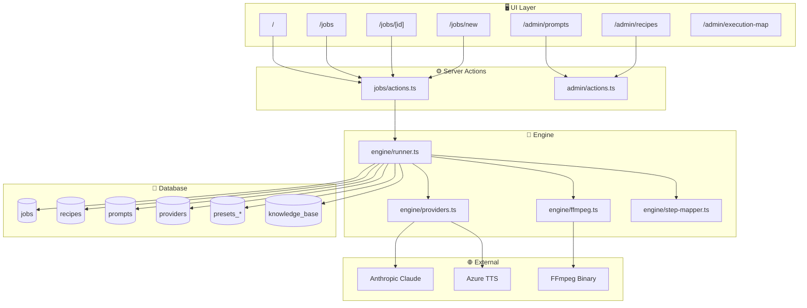

# Dependency Graph - 2025-12-18

## Visão Geral

---

## Matriz de Dependência

| Componente | Depende de | É usado por |
|------------|-----------|-------------|
| Dashboard | JobActions | - |
| JobActions | Runner, DB | UI pages |
| Runner | Providers, DB, StepMapper | JobActions |
| Providers | Claude SDK, Azure API | Runner |
| FFmpeg | FFmpeg binary | Runner |

---

## Blast Radius Analysis

| Componente | Se quebrar, afeta | Blast Radius |
|------------|-------------------|--------------|
| **runner.ts** | Toda execução de jobs | 🔴 5/5 |
| **providers.ts** | LLM e TTS steps | 🔴 4/5 |
| **jobs/actions.ts** | UI de jobs inteira | 🟡 3/5 |
| **admin/actions.ts** | Admin inteiro | 🟡 3/5 |
| Single component | Apenas aquela página | 🟢 1/5 |

---

## Componentes Críticos

1. **`lib/engine/runner.ts`** (1250 linhas) - Ponto único de execução de pipelines
2. **`lib/engine/providers.ts`** - Integrações Claude + Azure
3. **`lib/db/schema.ts`** - Definição de todas as tabelas
